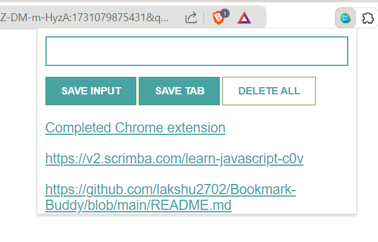

Here's an improved version of your **Bookmark Buddy** description, with a more polished and professional presentation:

---

# Bookmark Buddy

**Bookmark Buddy** is a Chrome extension designed to help you save and organize your favorite links or tabs directly within your browser. With simple and intuitive functionality, you can quickly capture URLs or manually enter links for easy access, without cluttering your bookmarks bar.

## Features

- **Save Input**: Manually enter and save any URL.
- **Save Tab**: Automatically capture and save the URL of the current tab with a single click.
- **Delete All**: Easily clear all saved links with a double-click on the "Delete All" button for quick cleanup.
- **Persistent Storage**: Your saved links are stored in local storage, ensuring they remain available even after a browser restart.

## Installation

1. Clone or download the repository.
2. Open **Chrome** and navigate to `chrome://extensions/`.
3. Enable **Developer mode** (top right corner).
4. Click **Load unpacked** and select the downloaded project folder.

## Usage

1. **Save a link manually**:
   - Enter a URL in the input field and click **Save Input**.
   
2. **Save the current tab**:
   - Click the **Save Tab** button to save the URL of the current tab.
   
3. **View saved links**:
   - Saved links are displayed as a clickable list under the buttons, for quick access.

4. **Delete all links**:
   - Double-click the **Delete All** button to clear all saved links at once.

5. **Try it live**: [Bookmark Buddy Live Demo](https://bookmark-buddy.netlify.app/)

## Files Overview

- **manifest.json**: The configuration file that defines the extension's settings and permissions.
- **index.html**: The main HTML file that structures the user interface.
- **index.css**: Custom CSS styles for the extension's layout and design.
- **index.js**: JavaScript that manages the core functionality of saving and deleting links.
